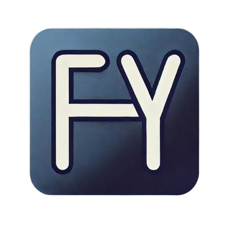

    
     
    <em><b>A Language for Modeling Physical Things</b></em>
      
    

<h1>
     
    FhY
</h1>

*A Language for Modeling Physical Things*

*FhY* is a cross-domain language with mathematical foundations that moves beyond the
current paradigm of domain-specific languages to enable cross-domain multi-acceleration.

We are currently working on the **first major release** of *FhY* and are getting very close!
If you would like to see our current progress, please check out the `dev` branch.

<!-- omit in toc -->
## Table of Contents

- [*FhY* Documentation](#fhy-documentation)
  - [*FhY* Design Blog](#fhy-design-blog)
- [Contributing - For Developers](#contributing---for-developers)
- [FhY License](#fhy-license)
- [Dependencies](#dependencies)

## *FhY* Documentation

### *FhY* Design Blog

The *FhY developers* provide a transparent "***Glass-House***" design blog to openly
describe current implementation details and software design decisions. We also discuss
various issues encountered during development and their solutions. Visit our
[*Read the Docs* page](https://fhy.readthedocs.io/en/latest/design_blog/index.html) to
gain familiarity with or to become involved with *FhY* language and development.

## Contributing - For Developers

Want to start contributing the *FhY*? Please take a look at our
[contribution guide](CONTRIBUTING.md)

## FhY License

FhY software is distributed under the [3-Clause BSD](LICENSE) open source license.

## Dependencies

| Software | License | Year(s)   | Copyright Holder(s)                                 |
|:--------:|:-------:|:---------:|:----------------------------------------------------|
| [ANTLR](https://github.com/antlr/antlr4) | [BSD-3](https://www.antlr.org/license.html) | 2012 | Terence Parr and Sam Harwell |
| [NetworkX](https://github.com/networkx/networkx) | [BSD-3](https://networkx.org/documentation/stable/#license) | 2004-2024 | NetworkX Developers Aric Hagberg <hagberg@lanl.gov> Dan Schult <dschult@colgate.edu> Pieter Swart <swart@lanl.gov> |

**DISCLAIMER**: the table above does **NOT** represent endorsement of *FhY* software, *FhY* copyright holders, or *FhY* contributors by any of the listed copyright holders, contributors, and respective softwares or organizations.
